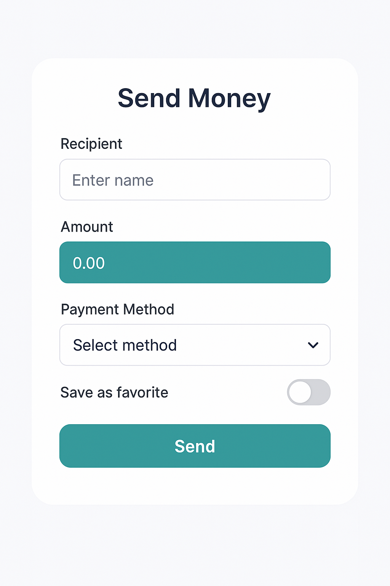
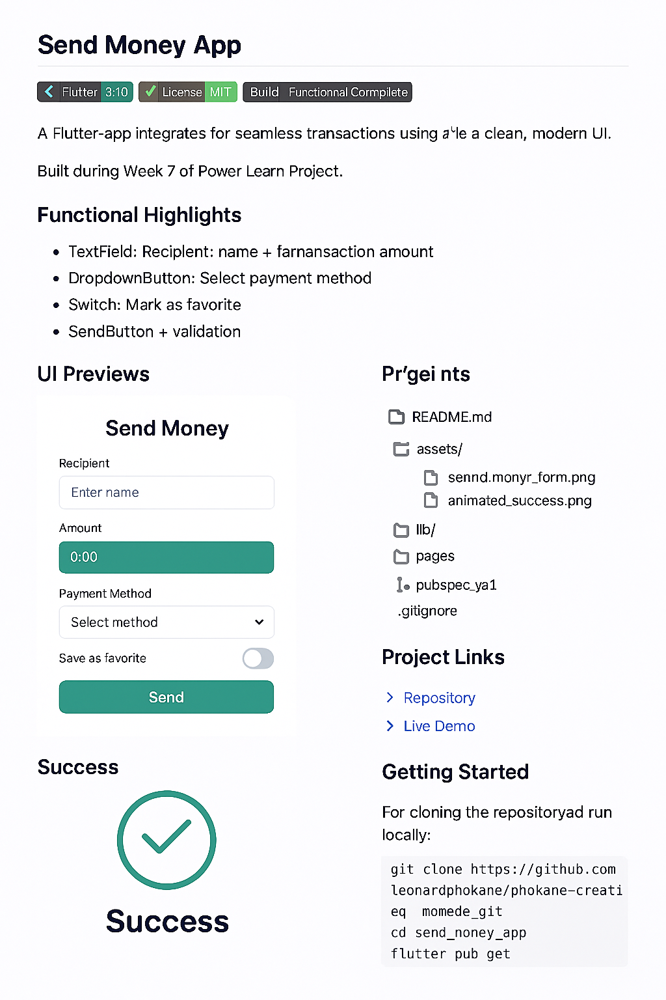

# 💼 Send Money App — Flutter Fintech Build (Week 7)
# Send Money App – v0.1 🚀

> "Transactions don’t just move money — they move stories." — Leonard Phokane

A mobile-first payment feature built with Flutter, designed to deliver secure transactions, modular design, and ethical branding through NeoBrand Surge visuals.

---

## 🚀 Functional Highlights

- 🧾 Form fields: Recipient name + transaction amount
- 🔽 `DropdownButtonWidget`: Select payment method (e.g. Bank Transfer, Mobile Wallet)
- 💡 Switch: Mark transaction as favorite
- ✅ Form validation: Empty fields + positive amount required
- 💳 `SendButton`: Reusable submission widget with branded styling
- 🌀 `AnimatedSuccess`: Confirmation overlay with auto-navigation

---

### 📸 UI Previews

---

## 📁 Folder Structure

lib/ ├── widgets/ │ ├── send_button.dart │ └── dropdown_button.dart ├── pages/ │ └── send_money_page.dart ├── main.dart

---

## 🔗 Project Links

- 🌍 Live Demo: [phokane-creative-code.lovable.app](https://phokane-creative-code.lovable.app)
- 📊 Pitch Deck: [View on Canva](https://www.canva.com/design/DAGsxJEVKSg/ODdyq2DctbdY100QGlFy9w/edit)
- 📦 GitHub Repo: [github.com/leonardphokane/phokane-creative-code](https://github.com/leonardphokane/phokane-creative-code)
- 🧭 Padlet Archive: [My Distinguished Padlet](https://padlet.com/plp9/my-distinguished-padlet-obiq9mj5yr6u1mxo)

---

## 🧠 Skills Applied

`Flutter Dev`, `Ethical Tech`, `UI/UX`, `NeoBrand Styling`, `Modular Architecture`, `Community-Centered Design`

---

## 👤 About the Developer

Built by **Leonard Phokane** — a storyteller who codes with soul and structures with legacy.

- 💼 LinkedIn: [linkedin.com/in/leonardphokane](https://linkedin.com/in/leonardphokane)
- 📦 GitHub: [github.com/leonardphokane](https://github.com/leonardphokane)
- 🌍 Portfolio: [phokane-creative-code.lovable.app](https://phokane-creative-code.lovable.app)
- 💌 Email: `leonardphokane1@gmail.com`

---

## 🧪 Week 8 Preview

Coming soon: Full UI expansion, multi-step user journey, loading states, and submission feedback loop.

> “From form validation to visual storytelling — this is where fintech meets purpose.”

---

Let me know if you want to add visual previews, badges, or a contributor section. You're not just writing a README — you're writing history 💻✨📘

---
# Send Money App – v0.1 🚀

> “I build with code, dream with clarity, and rise with purpose.” – Leonard Phokane

## 🌍 Overview
Send Money App is a cross-platform fintech tool designed to simplify digital transactions with elegance, speed, and cultural resonance. Built using Flutter, the app is engineered for Android, iOS, Web, and Windows with a focus on user-centric design and ethical development.

## 🔥 v0.1 – Project Genesis
This release marks the foundational setup of the app. It includes:
- ✅ Multi-platform scaffolding (Android, iOS, Web, Windows)
- 🎨 Afro-futurist branding assets integrated into the UI
- 🧼 Clean repo hygiene via `.gitignore` and `.gitattributes`
- ⚙️ Configs and assets to support animations and transaction workflows

📎 [View Release Page](https://github.com/leonardphokane/send_money_app/releases/tag/v0.1)

## 🛠️ Tech Stack
- Flutter + Dart
- Git + GitHub
- Canva + Padlet for visual storytelling
- Ethical frameworks via Fairness Inspector (coming soon)

## 📈 Upcoming Features (v0.2 Roadmap)
| Feature                   | Purpose                                          | Status      |
|--------------------------|--------------------------------------------------|-------------|
| SendButton Logic Flow    | Improve UX and transaction clarity               | In Progress |
| AnimatedSuccess Widget   | Celebrate transactions with visual flair         | Planned     |
| ZuluTech Brand Expansion | Deepen storytelling and design continuity        | Conceptual  |
| Fairness Audit Integration | Add equity checks through Fairness Inspector | Researching |

## 🤝 Collaborate With Us
Want to contribute or fork the vision? Join the movement via PLPCommunity or connect on LinkedIn.

## 🧠 Inspired By
ZuluTech — a commitment to building tech systems that honor cultural identity, integrity, and impact.

---

